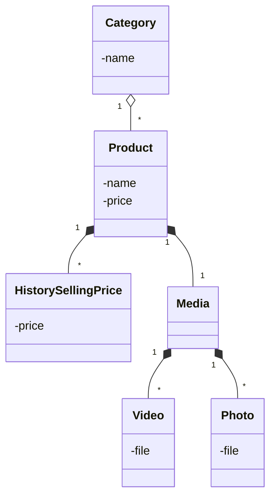

## Section A
### Question A.1
- a. The Waterfall model ensures a structured, sequential approach with thorough documentation and review at each stage, critical for safety-critical systems like autonomous vehicles to minimize errors and risks.

- b. Revisiting the Software Specification stage can lead to delays and cost overruns, as changes may require rework in design, implementation, and testing, increasing the project’s time and budget.

- c. 
  - Change Control: Evaluate and limit the scope of changes.
  - Version Control: Maintain updated and clear documentation.
  - Impact Analysis: Assess how changes affect other stages.
  - Stakeholder Communication: Ensure alignment on updates.
  - Contingency Planning: Include buffer time for refinements.
### Question A.2
- Scrum complies with "Customer collaboration over contract negotiation" through sprint reviews, where stakeholders and customers provide feedback to guide development, ensuring solutions meet their needs.

- The acceptance criteria for "Change UI Language" are missing:

    Outcome details (e.g., what happens after selecting a language).

    Negative scenarios (e.g., no languages available).
    
    Edge conditions (e.g., invalid selection or canceling the dialog).
### Question A.3
### Question A.4
- Risk identification: identify possible project, product, and business risks
- Risk analysis: assess the likelihood and consequences of these risks
- Risk planning: plans to address the risk, either by avoiding it or minimizing its effects on the project
- Risk monitoring: regularly assess the risk and your plans for risk mitigation and revise these when you learn more about the risk

## Section B
### Question B.1
