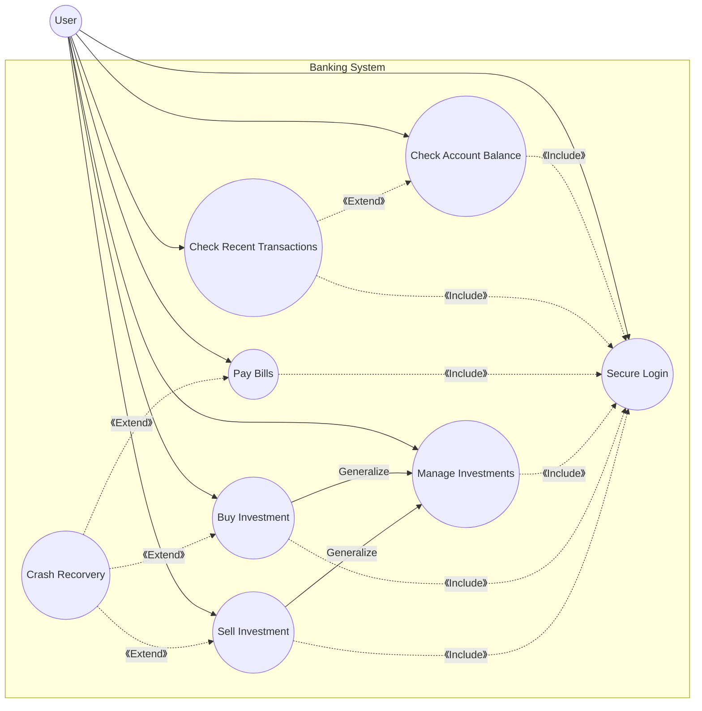
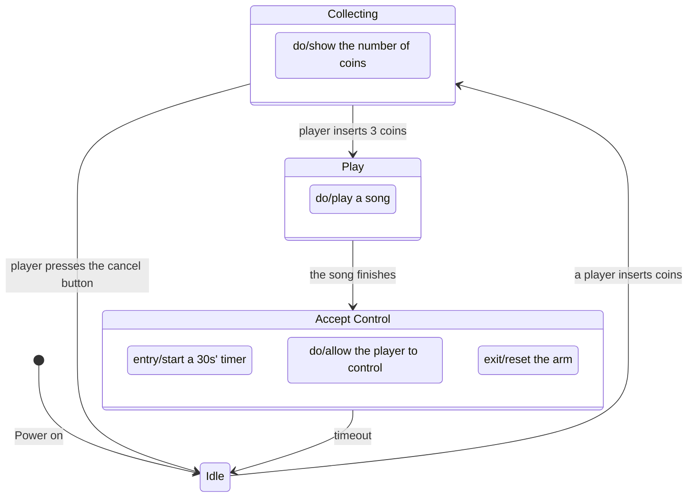

## Section A
### Question A.1
Software development comprises four key activities: specification, design and implementation, validation, and evolution & maintenance.

Specification defines what the software should do. This involves gathering and analyzing requirements, documenting them in structured formats, validating their accuracy with stakeholders, and managing changes throughout the project.

Design and Implementation create the software's architecture and code. This includes high-level and detailed design, prototyping, coding, code reviews, unit testing, component integration, and build management to ensure a cohesive system.

Validation ensures the software meets requirements and is defect-free. Key tasks include test planning, creating and executing test cases, tracking defects, regression testing, and acceptance testing to confirm readiness for deployment.

Evolution & Maintenance handle changes post-deployment. This includes fixing defects, adapting to new environments, enhancing performance or usability, preventing future issues, releasing updates, and supporting users through troubleshooting and training.

### Question A.2
- Focus

  Plan-Driven: Emphasizes planning, documentation, and quality assurance.

  Agile: Focuses on quick delivery and working software.
- Suitability:

  Plan-Driven: Suited for large, stable, long-term projects.

  Agile: Ideal for projects with rapidly changing requirements.
- Customer Involvement:

  Plan-Driven: Limited to specification and final acceptance.

  Agile: Continuous engagement and feedback throughout.
- Flexibility:

  Plan-Driven: Follows a rigid, pre-defined plan.

  Agile: Adapts easily to changes and new requirements.

### Question A.3


### Question A.4
No.
- Critical System: Lift scheduling is safety-critical, requiring detailed specifications to minimize risks, which Agile's flexibility does not ensure.
- Stable Requirements: The requirements are well-defined and unlikely to change, making a plan-based approach more effective.
- Formal Documentation: Extensive documentation is necessary for compliance and maintenance, which Agile's minimal documentation approach does not prioritize.

### Question A.5

Feasibility study, requirements elicitation and analysis, requirements specification, requirements validation

### Question A.6
```java
public class OrderTaker {
    public void takeOrder(Order order) {
    }
}

public class OrderPreparer {
    public void prepareOrder(Order order) {
    }
}

public class OrderServer {
    public void serveOrder(Order order) {
    }
}

public class BillingProcessor {
    public void billCustomer(Order order) {
    }
}

public class OrderProcesser {
    public void billCustomer(Order order) {
        new BillingProcessor().billCustomer(order);
    }

    public void takeOrder(Order order) {
        new OrderTaker().takeOrder(order);
    }

    public void prepareOrder(Order order) {
        new OrderPreparer().prepareOrder(order);
    }

    public void serveOrder(Order order) {
        new OrderServer().serveOrder(order);
    }
}
```
### Question A.7

- Model: central component of the pattern that directly manages the data, logic and rules of the application.
- View: can be any output representation of information, such as a chart or a diagram.
- Controller: accepts input and converts it to commands for the model or view, enables the interconnection between the views and the model.

### Question A.8

### Question A.9

- Avoidance Strategies: Reduce the chance of risks occurring.
  
  Example: Replace unreliable components with known reliable ones.
- Minimization Strategies: Reduce the impact of risks.
  
  Example: Reorganize teams to ensure role overlap for handling staff illness.
- Contingency Plans: Prepare for worst-case scenarios.
  
  Example: Establish a backup server to ensure data availability during system outages.

## Section B
### Question B.1

### Question B.2
