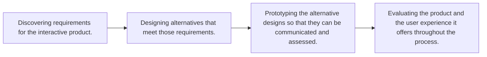

## Question 1
### (a)

- Discovering Requirements: This initial phase focuses on gaining a deep understanding of the problem space. Conducting user research (interviews, observations, surveys) with both patients and physicians to understand their current communication methods, pain points, needs, and goals. Analyzing existing healthcare communication tools. Identifying stakeholders beyond direct users (e.g., clinic administrators, IT staff) and understanding their perspectives. Gathering data on the context of use (e.g., when and where patients might need to schedule appointments, chat with doctors, or access health tips).
 Goals:
To clearly define the problem the app will solve.    
To establish specific usability and user experience goals for the app (e.g., ease of scheduling, secure messaging, clear presentation of medical history).    
To develop a comprehensive set of functional and non-functional requirements (e.g., the app must allow appointment scheduling; the app must be HIPAA compliant).    
- Designing Alternatives: Once requirements are understood, this phase involves generating various design solutions.

Key Activities:
Brainstorming different approaches to features like appointment scheduling, secure chat, medical history display, and health tip delivery.    
Creating conceptual models and sketches of different interface layouts and interaction flows.
Considering multiple design ideas, even seeking inspiration from different domains.    
Goals:
To explore a range of potential solutions that meet the identified requirements.    
To develop innovative ways to address user needs and improve the patient-physician communication experience.
- Prototyping: In this phase, the alternative designs are turned into tangible representations that can be tested.    

Key Activities:
Developing prototypes of varying fidelity, from simple paper mockups to interactive digital prototypes.
Focusing on prototyping key features of the mobile health app such as the appointment booking flow, chat interface, and how users would access their medical history.
Goals:
To create assessable versions of the design alternatives.    
To allow users and stakeholders to interact with the proposed designs and provide early feedback.
- Evaluating: This is an ongoing activity throughout the design process, where the prototypes and the evolving product are assessed.    

Key Activities:
Conducting usability testing with representative users (patients and physicians) to observe how they interact with the prototypes.    
Gathering feedback through methods like think-aloud protocols, questionnaires, and interviews.    
Analyzing the evaluation data to identify usability problems and areas for improvement.
Iterating on the designs based on the feedback received. This iterative cycle of prototyping and evaluating is crucial.    
Goals:
To ensure the app is effective, efficient, safe, easy to learn, and memorable.    
To verify that the design meets user needs and achieves the defined usability and user experience goals.    
To refine the app based on empirical measurement and user feedback. 
### (b)
- Visibility: Users should always be aware of what is happening and what they can do.    
Explanation: The system should clearly communicate its status and available actions. Important functions and information should be easily perceivable.
Application to the Health App:
Appointment Scheduling: Clearly indicate available time slots, confirm successful booking with a visible message, and show upcoming appointments prominently on a dashboard.
Chat: Show when a message has been sent, delivered, and read by the physician. Visibly indicate if the physician is online or when they last were.
Medical History: Use clear labels and visual cues to help users understand different sections of their medical history (e.g., lab results, medications, past appointments).

- Feedback: The system should provide immediate and informative responses to user actions.    
Explanation: Feedback confirms that an action has been registered, informs users of the results of their actions, and can guide them towards their goals.  It should be relevant, timely, and comprehensible.    
Application to the Health App:
Scheduling Appointments: After selecting a date and time, the app should immediately confirm if the slot is booked or if there's an issue (e.g., "Appointment Confirmed for May 10th at 2 PM" or "This time slot is no longer available. Please select another.").
Sending a Chat Message: Provide visual confirmation (e.g., a checkmark) when a message is successfully sent. A loading indicator could be shown while the message is being sent.
Receiving Health Tips: If a user subscribes to health tips, provide feedback when new tips are available or when preferences are updated (e.g., "Your health tip preferences have been saved.").

- Consistency: Designing interfaces with similar operations and elements for similar tasks makes the app easier to learn and use.    
Explanation: Consistency applies to terminology, appearance, and workflows.  This helps users transfer knowledge from one part of the app to another and reduces confusion.   
Application to the Health App:
Navigation: Use a consistent navigation pattern (e.g., a bottom navigation bar) across all sections of the app (Appointments, Chat, Medical History, Health Tips).
Button Design & Terminology: Buttons for primary actions like "Schedule," "Send," or "Save" should look and be labeled consistently throughout the app. Medical terms should be used consistently or clearly defined.
Error Messages: The style and placement of error messages (e.g., for incorrect password entry or failed appointment booking) should be consistent.
### (c)
To effectively recruit participants for user research and usability testing of your mobile health application, consider the following three strategies, drawing upon principles of usability testing and experimental design. These strategies will also help ensure a diverse and representative sample from your target user groups, which include patients and physicians.

Strategies for Participant Recruitment
- Targeted Recruitment Based on User Personas

Develop detailed user personas for both patients and physicians. For patients, these personas should capture variations in age, types of medical conditions (both general and specific if your app has a particular focus), digital literacy levels, and access to technology. For physicians, personas should reflect different specializations, years of experience, types of medical practice (e.g., private clinic, hospital), and familiarity with digital health tools.   
Use these personas to create specific screening criteria for potential participants. This ensures that those recruited are truly representative of your intended end-users.   
- Multi-Channel Outreach and Diverse Sourcing

Healthcare Providers and Institutions: Collaborate with clinics, hospitals, and other healthcare facilities. These can be excellent sources for recruiting both patients and physicians.
Patient Support and Advocacy Groups: Connect with groups relevant to the health conditions your app may address. These organizations can help reach specific patient populations.
Professional Medical Associations and Networks: For physician recruitment, leverage professional organizations and networks.
Online Platforms: Utilize online health forums, social media groups focused on health and wellness, and specialized participant recruitment platforms. This can help reach a broader and more diverse audience.
Community Engagement: Consider reaching out through community centers or events, especially to access user groups that may be less digitally connected.
- Screening and Stratified Sampling for Diversity

Implement a thorough screening process using questionnaires to confirm that potential participants match your target user profiles.
Actively strive for diversity within your sample. This means consciously selecting participants to ensure a mix of relevant characteristics. For patients, aim for diversity in age, health status, digital savviness, and potentially socioeconomic and geographical factors. For physicians, ensure representation from different specialties, practice sizes, and levels of experience.   
While usability tests often use 5-10 participants per user group, ensure that even within these smaller groups, there's an effort to capture diversity. You might need to run separate testing cohorts for significantly different user segments (e.g., elderly patients with low tech skills vs. young, tech-savvy patients).   
The process of iterative design and evaluation suggests that recruitment can be ongoing, adjusting outreach strategies if certain user segments are found to be underrepresented. Testing should ideally continue until no new significant insights are being gained from new participants.   

### (d)
- Why it's Critical:
Equity in Healthcare: A health app that is not inclusive can create or exacerbate health disparities by making essential services and information inaccessible to certain groups.
Broader Reach and Adoption: An accessible and inclusive app will be usable by a wider range of people, leading to greater adoption and impact.
Improved Health Outcomes: When people can easily access and use tools to manage their health, communicate with providers, and receive health information, it can lead to better health outcomes for all.
Ethical Responsibility: There is an ethical imperative to design healthcare solutions that serve everyone, especially vulnerable populations.
Here are three methods to ensure the mobile health application is accessible to users with different types of disabilities:

- Adherence to Accessibility Guidelines (e.g., WCAG):

Method: Design and develop the application following established guidelines like the Web Content Accessibility Guidelines (WCAG). This includes principles such as:
Perceivable: Ensuring that users can perceive the information being presented (e.g., providing text alternatives for non-text content like images – for instance, an icon indicating "schedule appointment" should have an alt text; ensuring good color contrast between text and background for users with low vision).    
Operable: Making sure users can operate the interface (e.g., ensuring all functionality is available from a keyboard for users who cannot use a mouse; providing sufficient time for users to read and use content).    
Understandable: Making information and the operation of the user interface understandable (e.g., using clear and simple language, providing predictable navigation).
Robust: Ensuring content can be interpreted reliably by a wide variety of user agents, including assistive technologies (e.g., screen readers for blind users).    
Specific to Disabilities: This addresses visual (e.g., screen reader compatibility, zoom functionality, color contrast), motor (e.g., keyboard navigation, larger tap targets), and cognitive disabilities (e.g., clear language, consistent navigation).    
Compatibility with Assistive Technologies:

Method: Actively test the application with common assistive technologies that users with disabilities rely on.
Screen Readers: Ensure that screen readers (like VoiceOver on iOS or TalkBack on Android) can accurately read out all content, labels for buttons and icons, and provide context for interactive elements.  For example, when a blind user navigates to the "Chat with Provider" button, the screen reader should announce its function clearly.   
Switch Control: For users with limited mobility, ensure the app can be navigated using switch control devices.
Voice Control: Design for compatibility with voice input for users who may have difficulty typing.
Specific to Disabilities: Primarily benefits users with visual impairments, motor impairments, and some learning disabilities.
Inclusive User Research and Testing:

Method: Intentionally recruit and involve people with a diverse range of disabilities throughout the design and testing process.
Early Feedback: Gather input from users with disabilities during the requirements gathering and design phases.
Usability Testing: Conduct usability tests with participants who have visual, auditory, motor, and cognitive impairments. Observe how they interact with the app and identify any accessibility barriers. For example, observe if a user with tremors can accurately tap on appointment slots or if a user with dyslexia can easily understand the health tips.
Diverse Perspectives: This ensures that the design decisions are informed by the real-world experiences and needs of users with disabilities.    
Specific to Disabilities: This approach helps identify and address a wide spectrum of accessibility issues across different disability types, including sensory, physical, and cognitive impairments. 