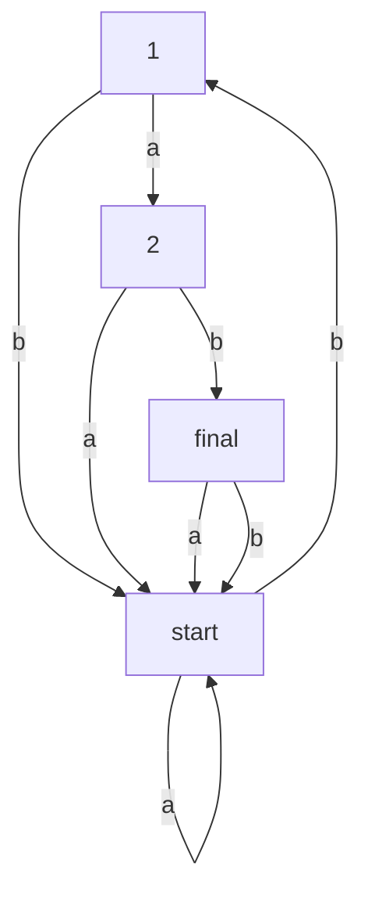

## Question 1
- (a) No. If its corresponding finite automata has a ring, then it must be infinite.
- (b) No. A is regular iff A has a NFA.
- (c) No. The transition function of a NFA maps a pair <state, symble> to a set of states (i.e. the possible next states). So the codomain of it is the power set of Q.
- (d) Yes. We can convert the NFA to a NPDA by giveing it a useless stack, and a language is CFL iff there is some PDA that recognizes it.
- (e) No. We can use pumping lemma proving {anbn} is not regular, but it's a CFL.
- (f) Yes. We know A has a regular expression, so A is regular, so A is alse a CFL, then it can be converted to CNF.
- (g) Yes. A language is Turing-recognizable if, for all strings in the language, the Turing machine halts and accepts; for strings not in the language, it may either halt and reject or loop indefinitely. In contrast, a language is Turing-decidable if the Turing machine always halts, accepting strings in the language and rejecting all others.

## Question 2
- (a) bab abab bbab aabab
- (b) No. Choose a in s.
- (c)

## Question 3
