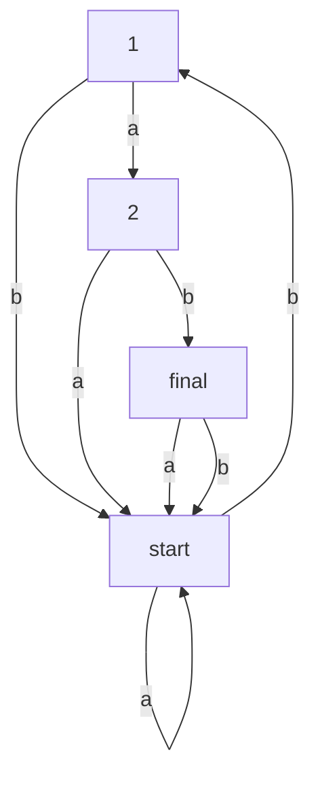

## Question 1
- (a) No. If its corresponding finite automata has a loop, then it must be infinite.
- (b) No. A is regular iff A has a NFA.
- (c) No. The transition function of a NFA maps a pair <state, symble> to a set of states (i.e. the possible next states). So the codomain of it is the power set of Q.
- (d) Yes. Regular languages are trivially CFLs: we can convert the NFA to a NPDA by giveing it a useless stack, and a language is CFL iff there is some PDA that recognizes it.
- (e) No. We can use pumping lemma proving {anbn} is not regular, but it's a CFL.
- (f) Yes. We know A has a regular expression, so A is regular, so A is alse a CFL, then it can be converted to CNF.
- (g) Yes. A language is Turing-recognizable if, for all strings in the language, the Turing machine halts and accepts; for strings not in the language, it may either halt and reject or loop indefinitely. In contrast, a language is Turing-decidable if the Turing machine always halts, accepting strings in the language and rejecting all others.

## Question 2
- (a) bab abab bbab aabab
- (b) No. Choose a in s.
- (c)

## Question 3
- (a) ii iii
- (b)

| a  | b |
| ------------- | ------------- |
| {2, 3}  | {}  |
| {}  | {1, 3}  |
| {2, 3} | {1} |
| {} | {} |

## Question 4
- (a|b)\*b(a|b)(a|b)\*
- (a\*b)\*a\*

## Question 5
- Get rid of all epsilon productions
- Get rid of all productions where RHS is one variable

  S→ASA|aB
  
  A→b|ASA|aB
  
  B→b
- Replace every production that is too long by shorter productions

  S→AC|aB
  
  A→b|AC|aB
  
  B→b

  C→SA
- Move all terminals to productions where RHS is one terminal

  S→AC|DB
  
  A→b|AC|DB
  
  B→b

  C→SA

  D→a

## Question 6
- (a) iii
- (b) i
- (c) {aibjck | i+j=k}

## Question 7
- (a) q2
- (b) q3

## Question 8
- (a) Recursive language is Turing-decidable language, recursively enumerable language is Turing-recognizable language.
- (b) Reduction is a way of converting one problem to another problem, so that the solution to the second problem can be used to solve the first problem. If A reduces to B, then any solution of B solves A.
  
• If A is reducible to B, then A cannot be harder than B.

• If A is reducible to B and B is decidable, then A is also decidable.

• If A is reducible to B and A is undecidable, then B is also undecidable.
